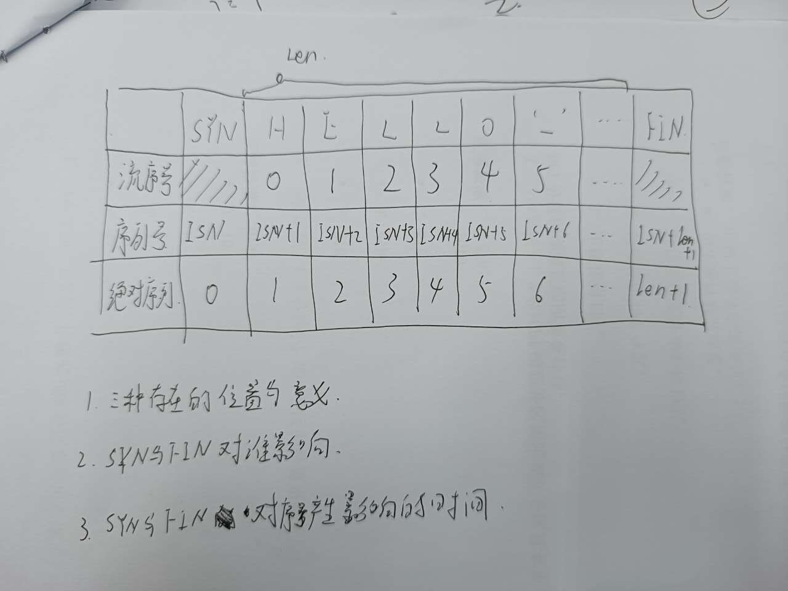

# Checkpoint 2 Writeup

> **实现 TCPReceiver**
>
> 现在，在实验 2 中，你将实现 TCP 中处理入站字节流的部分：`TCPReceiver`。在编写 `StreamReassembler`和 `ByteStream`时，你已经完成了其中大部分的“算法”工作；本周主要讨论如何将这些类连接到 TCP 格式。这将涉及到考虑 TCP 如何表示每个字节在流中的位置——即所谓的”序列号”。`TCPReceiver`负责告诉发送方
>
> - (a) 它能够成功地组装多少入站字节流（这被称为“确认(ack)”）。
> - (b) 发送方现在被允许发送的字节范围（“流控制窗口”）。

实验内容：实现 TCP 接受方

- 正确的接受数据包
- 重新组装
- 发送到内存
- 返回确认和流量控制信号

---

任务 1：完成序列号

- 绝对序列号 ： 网络通讯中的实际上的序列号 包括开始结尾
- 序列号 ： 包含 ISN 网络传输中 包中的序列号 包括开始结尾
- 流序号 ： 在流中的位置 不包括开始结尾

流和绝对序列号很好转换 流 = 绝对+1

但是 序列号和绝对序列号并不是很好转换 我们需要处理两方向的转换

绝对序列号 -> 序列号：

    这里需要ISN 也就是随机的起点 当我们绝对序列号为x 的时候 我们的序列号就是 (x + ISN) % 序列长度

序列号 -> 绝对序列号:

    这里也需要ISN 也就是随机的起点 当我们序列号为y的时候 可能对应相当多的绝对序列号 比如序列长度\*1 + （y - ISN + 序列长度) % 序列长度  或者 序列长度 \*2 + （y - ISN + 序列长度) % 序列长度 等等

    为了消除这种二义性 我们引入了检查点（checkpoint) 利用检查点 我们可以确定最接近的绝对序列号 从而消除二义性

开始时间：2023/10/9 - 11.00

完成截图：

任务成果：

- 我们得到了一个新的类型 Wrap

  static Wrap32 wrap( uint64_t n,Wrap32 zero_point ); 用于生成一个本类型 传入参数为绝对序列号和 ISN

  uint64_t unwrap( Wrap32 zero_point,uint64_t checkpoint ) const;用于返回基于一个 ISN 和 checkpoint 对应的序列号的绝对序列号数值

结束时间： 2023/10/9 - 15.00

---

任务 2： 实现 TCPReceiver

开始时间：2023/10/9 - 15.50

任务内容：

- (1) 从它的对等方接收内容
- (2) 使用你的 `StreamReassembler`重新组装 ByteStream
- (3)计算 确认号(ackno)
- (4)计算 窗口大小

实验内容分析:

    主要完成接受对等方内容和返回确认号和窗口大小这几件事

难点：

三种序号的加深理解 和 SYN FIN 标志的影响：

1. 三种流的位置与存在意义

- 流索引 - 内存字节流中的序号 也是最后 string 字符串的下标 最多 64 位 - byte_stream
- 序列号 - 存在于 TCP 包中 在 TCP 包中作为序列号 32 位 - tcp_receiver
- 绝对序列号 - 存在于组装器中 记录了传输的字节数量 - reassembler

2. syn 和 fin 对三个组成部分的影响

- 对 byte_stream - syn 几乎无影响 fin 决定通过重组器 使其关闭
- 对 reassembler 因为要保证每一个字节都收到 所以 syn 应该占据一个位置 所以当收到 syn 的时候应该进行 readynum++ 同样道理 fin 也应该++
- 对 tcp_receiver 是根据包的标志位在这一层抽象进行的设置

3. 影响生效的时间

- SYN ： 影响生效的时间应该是这个信息处理过后 再对重组器进行设置
- FIN ： 同样是这个信息处理过后再进行设置 不过要注意是重组器对其处理结束也就是字节流关闭之后进行设置

AC:

实验结果：

    我们得到了 tcp_receiver 到现在位置 我们已经处理好了 tcp 在接受信息的时候传输层 接收端 应该做的事情（比较粗略 没有包含各种意外情况的处理 只有简单的应答和窗口数据）

结束时间：2023/10/9 - 18.00
