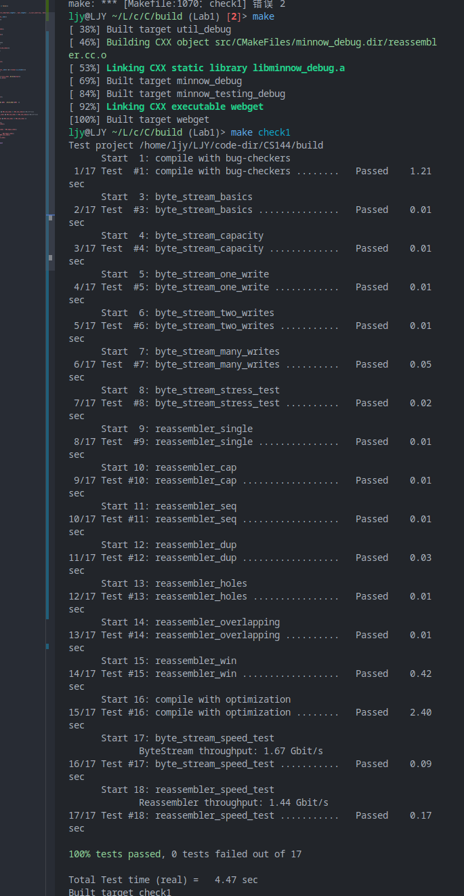

# Checkpoint 1 Writeup

> 首先让我们看看接下来几个实验的任务：
>
> - 在实验 1 中，你将实现一个流重组器——一个将字节流的小块（称为子串，或段）按正确顺序组装成连续的字节流的模块。
> - 在实验 2 中，你将实现 TCP 中处理入站字节流的部分：`TCPReceiver`。这需要考虑 TCP 如何表示每个字节在数据流中的位置，即所谓的序列号。`TCPReceiver`负责告诉发送方(a)它已经成功地组装了多少入站字节流（这被称为 “确认”）和(b)发送方现在允许再发送多少字节（”流量控制”）。
> - 在实验 3 中，你将实现 TCP 中处理出站字节流的部分：`TCPSender`。当发送方怀疑它所发送的一个段在途中丢失了，并没有到达接收方时，它应该如何反应？它应该在什么时候再次尝试并重新传输一个丢失的段？
> - 在实验 4 中，你将结合你在前面几个实验中的工作，创建一个工作的 TCP 实现：一个包含 `TCPSender`和 `TCPReceiver`的 `TCPConnection`。你将用它来与世界各地的真实服务器对话。

---

任务 1：将子字符串按顺序排列

任务介绍：

    在本实验和下一个实验中，你将实现一个 TCP 接收器：接收数据报并将其转化为可靠的字节流供用户读取的模块（就像你的`webget`程序从实验 0 中的 `webserver`读取字节流一样）。

    TCP 发送方将其字节流分为短段（每个子串不超过 1,460 字节），以便它们各自在一个数据报中。但网络可能会对这些数据报进行重新排序，或丢弃它们，或多次传送它们。接收方必须将这些片段重新组合成它们开始时的连续的字节流。

    在本实验中，你将编写负责重新组装的数据结构：一个`StreamReassembler`。它将接收子串（由一串字节和大数据流中该串的第一个字节的索引组成），并提供一个 `ByteStream`，其中所有的数据都被正确排序。

任务分析：

1. 整体来讲 实验 1 2 是负责把分散的数据包 整理合并成为一个可靠的数据流 类似 TCP/IP 中的滑动窗口
2. 在本次实验中 我们要做到把多个字串进行排序
3. 在本次实验中 我们需要对重复包以及重叠的包进行处理
4. 可能在后续的实验中 会涉及到滑动窗口的长度 三个指针 以及回应包的设置问题

开始时间：2023/10/4 - 20.20

实验过程：

1. 如何进行数据存储
   1. 我们选择的是 map key 记录下标 val 记录节点信息
      1. 利用 key 进行二分搜索加快包合并的速度
2. 利用 map 中存储的数据是无交叉的 作为等待存储的信息集合 同时维护队列中的元素数量

AC 截图：

实验结果：

    我们得到了一层重组器抽象： 无序 - > 有序

    输入： 包的序列号 包信息 目标流

    输出： 向目标流中输出有序的包的信息

    保证： 向目标流中输出的信息不会超过目标流的容量上限

开始时间：2023/10/7 - 1.15
