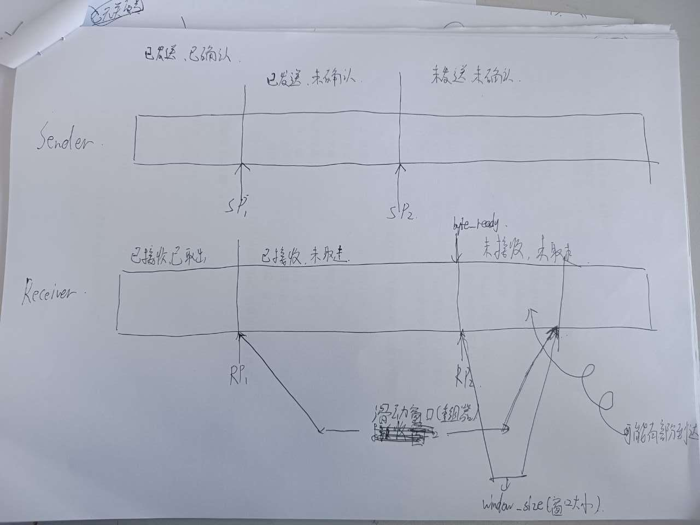
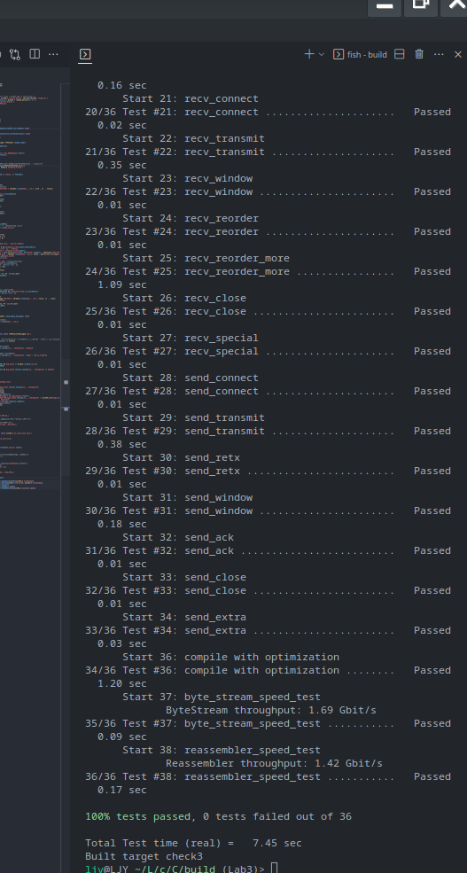

# Checkpoint 3 Writeup

> 本周，你将实现 TCP 的“发送方”部分，负责读取 `ByTestStream`（由某些发送方应用程序创建并写入），并将流转换为一系列传出 TCP 段。
>
> `TCPSender`将负责：
>
> - 跟踪接收方的窗口（处理传入的确认号（ **ackno** ）和窗口大小（ **window size** ）） ；
> - 尽可能通过读取 `ByTestStream`、创建新的 TCP 段（包括 SYN 和 FIN 标志，如果需要），填充窗口，并发送它们；
> - 跟踪哪些段已经发送但尚未被接收方确认——我们称之为“未完成的”段；
> - 如果发送后经过足够的时间但尚未确认，则重新发送未完成的段；

分析：

1. 处理接收方的回信 -> ackno 以及 窗口确定大小 -> 决定下一次的发送内容
2. 创建发送内容 -> 对应标志位的设计 确定内容长度和信息量 -> 发送
3. 做好重发准备 -> 统计未完成段 和 超时重传

分为两个大部分：

1. 发送部分： 通过字节流处理好应该发送的部分信息 并且发送
2. ACK 处理 和 重传：
   - 处理好回复信息 决定下次应该发送什么 和
   - 本地设置定时器当时间到了没有收到回复信息 决定重传

---

任务 1:重传定时器

开始时间： 2023/10/10 - 12:00

任务分析：
实现设计重传定时器
1 ： RTO 如何更新
2 ： 定时器什么时候重启
3 ： 连续重传次数什么时候复位

--> 设计出 tick 的行为

> 规则如下
>
> 1. 每次发送包含数据（在序列空间中长度非零）的段（不管是第一次还是重传），如果 timer 没有运行，就启动它，使它在 RTO 毫秒后失效（对于 RTO 的当前值）。
> 2. 当所有未完成的数据都被确认后，关闭重传计时器。
> 3. 如果 tick 被调用，并且重传计时器已经过期：
>
>    1. 重传 TCP 接收方尚未完全确认的最早（最低序列号）段
>    2. 如果窗口大小为非零：
>
>       1. 跟踪连续重新传输的次数，并增加它，因为你刚刚重新传输了一些内容。你的 TCPConnection 将使用这些信息来决定连接是否无望（连续重传次数过多）并需要中止。
>       2. 将 RTO 的值增加一倍。（“指数回退”）
>       3. 启动重传 timer，使其在 RTO 毫秒后过期（对于前一个要点中概述的加倍操作后的 RTO 值）。
>          1. 当接收方给发送方确认成功接收新数据的 ackno 时（该 ackno 反映了一个大于之前的任何 ackno 的绝对序列号）。
>             (a) 将 RTO 调回其“初始值”。
>             (b) 如果发送方有任何未完成的数据，重新启动重传 timer，使其在 RTO 毫秒后失效（对于 RTO 的当前值）。
>             (c) 将“连续重传”的计数重设为零。

1 ： RTO tick 超时的时候加倍 在接受到一个 ACK 包 且这个 ACK 包成功使得一些没被确认的包被确认时
2 ： 定时器什么时候重启 在每次发送新的包的时候查看是否已经打开 没打开则打开定时器 在接受到一个 ACK 包 且这个 ACK 包成功使得一些没被确认的包被确认时 重启清零后的定时器（或者关闭)
3 ： 连续重传次数什么时候复位 在重传内容没有得到回复的时候+1 当有回复了 置 0
tick 的行为 : 重传 ， 在只要 tick 超时 就证明一定有包要被重传（队首的包 ) tick 只跟踪队首的包 严格来讲并不是所有包到了 RTO 就一定会被重传 比如第二个包 甚至可以接近 2RTO

结束时间： 2023/10/10 - 12:00

---

任务 2:编写 Sender

开始时间： 2023/10/11 - 15:00

如图 sp2 - sp1 = window_size
发送端左窗口应该是已发送 已确认的数值 右窗口应该是左窗口+window_size

明确功能任务：

    向上提供 send_empty_message 和 maybe_send 两个函数 由TCPconnect 负责 具体的信息发送和接收任务

    明确发送方的状态以及状态之间切换

一些细节：

    信息成功推送的时间 ： push就是把字节流推送到网络

    windowsize和Able_send : Able是能够发送的大小 当windowsize为0的时候 表示对方不接受信息 此时截取一字节的信息 在不增加RTO的情况下不断尝试访问 叫零窗口探测 其余时间Ablesend 等于 windowsize - 等待的长度

AC 截图：

完成时间： 2023/10/13 - 15:00
