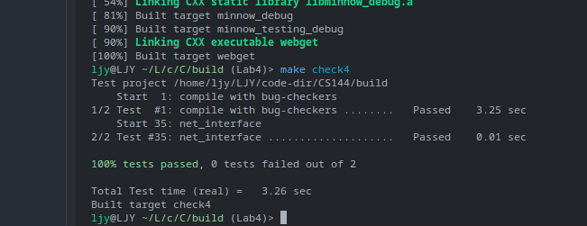

# Checkpoint 4 Writeup

> 顶峰(summit)(完整的 TCP)
>
> 本周，你将完成构建一个与互联网上数十亿台计算机和移动设备兼容的工作 TCP 实现。你已经完成了大部分的工作：你已经实现了发送方和接收方。本周你的工作是将它们”连接”起来，成为一个对象(`TCPConnection`)，并处理一些对连接来说是全局性的管家任务。

> 终于实现相对完整的 TCP 了！！！

---

我们应该做什么：

    **TCP-in-IP-in-Ethernet.（我们将要实现的）** 网络接口将出站 IP 数据报转换为链路层（以太网）帧，反之亦然。代替 Linux 提供的 TUN 设备接口，这样 Linux 内核可以直接获得并处理以太网帧。

    1. 出站 IP -> 以太帧

    2. 以太帧 -> 入站ip

    3. 以太帧 -> 入站ip包 -> 出战ip包 -> 以太帧（转发)

开始时间： 2023/10/14 - 22.30

结束时间： 2023/10/15 - 2.30

> 出现点小状况 2023 版本 在 Lab4 上相比 2022 版本难度下降了很多 Tcpconnect 也只是作为 第二层和第三层之间的转换 也是向上提供接口 并没有达到我们预期的锻炼难度 所以决定去做 2022 版本
>
> 加油！
